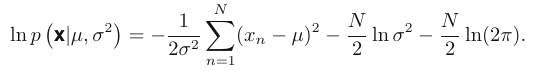

# History
Some basic concepts of Pattern Problem:
- Supervised learning: Classification, Regression
- Unsuperviserd learning: Clustering, density estimation, visualization (dimension reduction)
- Reinforcement learning

Some important tool use through the book:
- probablility theory
- decision theory
- information theory

# Polynomial Curve Fitting

  
             
 - Using RMS errors to validate the generation of model
 - Watch the over-fitting problem! (Using the bayansian, maximum likelihood to solve)
 - Introducing the regularization, in order to discourage the coefficients from reaching large values
  => quadratic regularizer (`ridge regression`), in neural networks this approach is known as weight decay.
 
 Summary of this sub_chapter: When deal with `Polynomial Curve`. We much to choose degree carefully. Using weight decay for later convinient. Using valid set and error measument proper for the better model!
 
 => This book is all about the prob!!!

# Probability Theory
A key concept in the field of pattern recognition is that of uncertainty.
=> Probability theory provides a consistent framework for the _quantification and manipulation_ of uncertainty.
We have two random variables $X, x_{i,..M}$ and $Y, y_{j,..L}$ Some basic equations:
- Joint probability: $P(X=x_i, Y=y_j)$ 
 => `Sum rule`, and _marginal probability_ : $p(X = x_i) = \sum_{j=1}^{L}p(X = x_i, Y = y_j)$
 
- Condition probability: $P(Y=y_j| X=x_i)$ 
=> `Product rule`: $p(X = x_i , Y = y_j) = p(Y = y_j|X = x_i)p(X = x_i)$ (some trick calculate here)

From two rule above, we have the bayes theorem, which used through this book:
               $p(Y |X) = \frac{p(X|Y )p(Y )}{p(X)}$        and        $p(X) = \sum{p(X|Y )p(Y )}$ 

Remember the `prior probability` (have before) and `posterior probability` (have after)

## Probability densities
 $p(x)$ is called the probability density over $x$ where:  $p(x ∈ (a, b)) = \int_{a}^{b}{p(x) dx}$ 
                                                         
## Expectations and covariations
The average value of some function $f(x)$ under a probability distribution $p(x)$ is called the expectation of $f(x)$, defined by $E[f] = \int{p(x)f (x)dx}$ and will be denoted by $E[f]$. 

The variance of $f(x)$ is defined by $var[f] = E[(f(x) − E[f(x)])^2]$ and provides a measure of how much variability there is in $f(x)$ around its mean value $E[f(x)]$. If x and y are independent, then their covariance vanishes.
## Bayensian probabilities
Formular, with prior probability distribution $p(w)$.
                           
                           $p(w|D) = \frac{p(D|w)p(w)}{p(D)}$
    
- This allows us to evaluate the uncertainty in w after we have observed $D$ in the form
of the posterior probability $p(w|D)$.
- The quantity $p(D|w)$ on the right-hand side of Bayes’ theorem is evaluated for the observed data set D and can be viewed as a function of the parameter vector $w$ => `likelihood function`

When have the likelihood, the we defined Bayes as:

                               $posterior ∝ likelihood × prior$
=> And the likelihood function $p(D|w)$  

A widely used frequentist estimator is `maximum likelihood`, in which w is set to the value that maximizes the likelihood function $p(D|w)$. 

**There has been much controversy and debate associated with the relative mer-
its of the frequentist and Bayesian paradigms** _noninformative priors_ (when the chosing of prior is difficult)
=> Bayesian methods based on poor choices of prior can give poor results with high
confidence.
Some extra material: sampling methods, such as Markov chain Monte Carlo

## The Gaussian distribution
The most important probability distributions for continuous variables:

  
- Mean = $\mu$, the square root of the variance, given by $σ$, is called the standard deviation. And $β = 1/σ^2$ , is called the precision.

Gaussian distribution defined over a D-dimensional: 

 

- Where the D-dimensional vector $μ$ is called the mean, the $D × D$ matrix $Σ$ is called
the covariance.

When viewed as a function of $μ$ and $σ^2$ , this is the likelihood function for the Gaus-
sian for independent and identically distributed dataset $\textbf{x}$ :

 
- we shall determine values for the unknown parameters $μ$ and $σ^2$ in the Gaussian by maximizing the likelihood function. In practice, it is more convenient to maximize the log of the likelihood function.

Apply logarit, we have:
 

- Maximizing above equation with respect to $μ$, we obtain the maximum likelihood solution
given by $\mu_{ML} = \frac{1}{N}\sum_{n=1}^{N}x_n$ => which is the sample mean!!!.
- Similarly, maximizing with respect to $σ^2$ is $\sigma_{ML}^{2} = \frac{1}{N}\sum_{n=1}^{N}(x_n - \mu_{ML})^2$  

*But there are problem with maximum likelihood*: systematically underestimates the variance of the distribution. This is an example of a phenomenon called bias and is related to the problem of over-fitting encountered in the context of polynomial curve fitting.

Sumary: We know the most important distribution for continue variables _Gauss_. How to measure mean and variation. The distribution is still true for vector $\textbf{x}$ (element of $\textbf{x}$ independency). How to calculate the maximum likelihood from this distrubition, and the problem with _variation-bias_.

##  Curve fitting re-visited

Example given by: $p(t|x, w, β) = N(t|y(x, w), β^{-1}$ 

  
 
 We cal the maximum likelihood (ln version):
  
  
  Using the results of maximum likelihood above, we can calculate the $w_{ML}$ and $β_{ML}$.
  => Having determined the parameters w and β, we can now make predictions for new values of x. Because we now have a probabilistic model, these are expressed in terms of the predictive distribution that gives the probability distribution over t, rather than simply a point estimate.
  
  From these things, we have introduction of _maximum posterior_:
     
  - We can now determine w by finding the most probable value of w given the data, in other words by maximizing the posterior distribution.
## Bayesian curve fitting
Till now, we still need making a point estimate of $w$ and so this does not yet amount to a Bayesian treatment. Trying to fully Bayesian approach!!! => that we integrate over all values of $w$.

The new t is predict by distribution (so it not anymore depend on $w$):
  
    

#  Model selection
Introducing the _cross_validation_ method

  
# The curse of Dimensionality
Assume we have thress class, and each datapoint has 12 dimesions. The figure below is a naive approach to classify classes. By using divided cells.

  
But the problem occurs when the dimension increase => the cells are increase exponential.

Introducing the `manifold` technique.

# Decision Theory
Link: [Decision Theory explained](https://www.youtube.com/watch?v=KYRAO8f5rXA&ab_channel=mathematicalmonk)
Using Probability theory to deal with quantifying and manipulating uncertainty. Combind this Decision theory to => make optimal decisions in situations involving uncertainty.

## Minimizing the misclassification rate

Consider $C_k$ -> $R_k$ (decision regions). $R_k$ must be continuous but can have disjoint points (these points are missclass).

So the optimal decision rule is minimize the $p$ mistake:
                      $p(mistake) = \int_{R1}{p(x, C_2)dx} \int_{R2}{p(x, C_1)dx}$
Choose the decision with $p(mistake)$ as small as possible!!!

Another choise is we have $p(x, C_k ) = p(C_k |x)p(x)$ based on the product rule,  $p(x)$ is common
=> we can restate this result as saying that the minimum probability of making a mistake is obtained if each value of x is assigned to the class for which the `posterior probability` $p(C_k |x)$ is largest.

## Minimizing the expected loss
Introduction of loss function or cost function.
Assume we have point x, which belong to the $C_k$, but is predicted to $C_j$. The loss function is defined by: $L_{jk}, L_{jk}$ belong to $L_{matrix}$

For a given input vector $x$, our uncertainty in the true class is expressed through the joint probability distribution $p(x, C_k)$ and so we seek instead to minimize the average loss, where the
average is computed with respect to this distribution, which is given by:

 
 Each $x$ can be assigned to one of regions $R_j$
 => Minimize above loss function => Minimize: $\sum_{k} L_{kj}p(x, C_k)$.
 Using the product rule: $p(x, C_k) = p(C_k|x)p(x)$, p(x) is common factor can be eliminate
 => trivial problem when we know the posterior class probabilities $p(C_k|x)$.
 
## The reject option
Example: In our hypothetical medical illustration, it may be appropriate to use an automatic system to classify those X-ray images for which there is little doubt as to the correct class, while leaving a human expert to classify the more ambiguous cases.

Introducing the threshold $θ$ where the posterior class probabilities $p(C_k|x)$ is less than or equal to $\theta$.
 

## Inference and decision

## Loss functions for regression

# Information Theory
