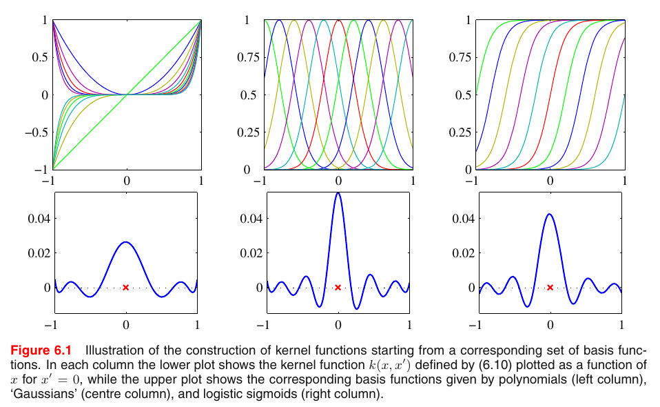
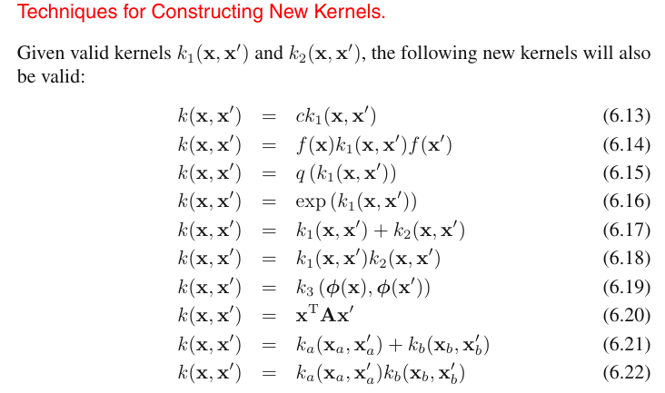
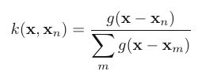
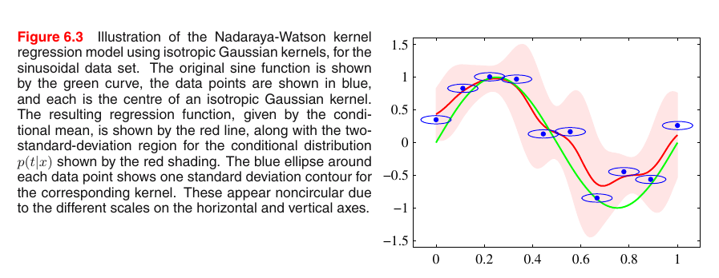
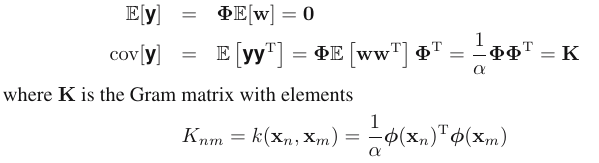

# Kernel
- What is kernel?
Kernel is a way of computing the dot product of two vectorsandin some (possibly very high dimensional) feature space, which is why kernel functions are sometimes called "generalized dot product".
[intuituvely explained: ](https://stats.stackexchange.com/questions/152897/how-to-intuitively-explain-what-a-kernel-is)
- Mercer's theorem?
- Parzen probability density?
Many linear parametric models can be re-cast into an equivalent `dual representation` in which the predictions are also based on linear combinations of a kernel function evaluated at the training data points.
    
                                         $k(x, x') = φ(x) T φ(x')$
                                         
The concept of a kernel formulated as an inner product in a feature space allows us to build interesting extensions of many well-known algorithms by making use of the kernel trick, also known as `kernel substitution.`

- Some formular kernel:
    + Stationary kernels: $k(x, x') = k(x − x')$ (khong thay doi khong gian dau vao)
    + homogeneous kernels (RBF)
- How it can be use in Machine Learning, particularly SVM?

#  Dual Representation
- What is dual Representation?
Basically, it just a mapping, a combination of input representation (with linear) or higher input dimension (if using kernel).
                                            
Userful link: [how-does-dual-representation-relate-to-support-vectors](https://stackoverflow.com/questions/41248982/how-does-dual-representation-relate-to-support-vectors)
=> Vẫn chưa thấy nó liên quan gì đến Duality trong SVM?
# Constructing Kernels
- One approach is to choose a feature space mapping $φ(x)$ and then use this to find the corresponding kernel
1. Construction of kernel functions starting from a corresponding set of basis functions

     

2. Construct kernel functions directly
- We must ensure that the function we choose is a valid kernel! 
=> We need a simple way to test whether a function constitutes a valid kernel without having to construct the function $φ(x)$ explicitly.
Solution for this: `Gram matrix K`
- So what is Gram matrix K? First we introduce the Mercer's theorem!
Let $X = \{x^{(1)}, ... , x^{(m)} \}$  be a data set of $m$ points. Then the function $K$ which maps:
                                        => $K(x^{(i)},x^{(j)}) : \mathbb{R}^n \times \mathbb{R}^n \rightarrow \mathbb{R}$ 
is a valid Kernel *if and only if* the matrix, called the *Kernel matrix* , or *Gram matrix* is *symmetric, positive semi-definite*.
- Why need symetric: $K(x^{(1)}, x^{(2)}) = K(x^{(2)}, x^{(1)})$ 
- Why need positive semi-definite: [Mercer's theorem](https://see.stanford.edu/materials/aimlcs229/cs229-notes3.pdf) 
The matrix $K$ is an $m*m$  matrix where each entry is the kernel of the corresponding data points.
                                         => $G_{i,j} = K(x^{(i)}, x^{(j)})$ 
                                         
 3. Constructing new kernels is to build them out of simpler kernels as building blocks                    
          
        
    4. From a probabilistic generative model
   
# Radial Basic Function Networks
- When talk about the combination of basic functions, one choice that has been widely used is that of radial basis functions.
- Why?
RBF have the property that each basis function depends only on the radial distance
(typically Euclidean) from a centre μ , so that $φ(x) = h(||x − μ||)$. 
- Easy undertand video: [RBF kernel](https://www.youtube.com/watch?v=Z2_yh2sice8&ab_channel=AIQCAR), addition the $\gamma$ parameter!

## Nadaraya-Watson model
- Parzen density estimator: Density estimation method for continue variables based on Gaussian (or another types) distribution. Nice explained [parzen-window-kernel-density-estimation](https://stats.stackexchange.com/questions/244012/can-you-explain-parzen-window-kernel-density-estimation-in-laymans-terms)
Using Parzen, apply to linear regresion to find the average density function $f(x, t)$ to get the regression function $y(x)$.
After _tinh toan mot hoi se ra dk cai kernel the nay :v_ :

   
  
And we have (this is Nadaraya-Watson mode:  

                                                  $y(x) = \sum_{n}{k(x, x_n)t_n}$
                                     
=> For a localized kernel function, it has the property of giving more weight to the data points $x_n$ that are close to x. And the kernel sastisfie:

                                                   $\sum_n{k(x, x_n)} = 1$
                                                   
Example:
  
  
# Gaussian Processs
1. Explained video about the Gaussian Process:
- Small version: [quite good link](https://www.youtube.com/watch?v=vU6AiEYED9E&ab_channel=mathematicalmonk)
- Funny and awesome version: [Cornell video](https://www.youtube.com/watch?v=R-NUdqxKjos&ab_channel=KilianWeinberger)

2. Some support material for this topic:
- MLE: 
                                                    $P(D/w)$
- MAP:
                                                    $P(w/D)$
 Where D is dataset, w is weights.
 
## Linear regression revisited
Consider a model defined in terms of a linear combination of M fixed basis functions given by the elements of the vector $φ(x)$ so that:
                                           $y(x) = w^Tφ(x)$                                       (1)
Consider prior distribution over w:
                                        $p(w) = N(w|0, α^{-1}I)$                                (2)
Convert (1) to:
                                         $y = Φw$                                                       (3)
Because we set prior distribution of w in (2) => (3) is Gaussian distribution (y). There for we need to find the mean and cov of y. And we have and $k(x, x')$ is the kernel function.

          
   
The specification of the Gaussian process is then completed by giving the covariance of $y(x)$ evaluated at any two values of $x$, which is given by the kernel function:
                                        $E[y(x_n)y(x_m)] = k(x_n , x_m)$
                  
## Gaussian processes for regression
We need to take account of the noise on the observed target values:
                                                  $t_n = y_n + \epsilon_n$ 
                                       => $p(t_n|y_n) = N(t_n|y_n , β^{-1})$        
Where $β$ is a hyperparameter representing the precision of the noise. The joint distribution of the target values $t = (t_1 , . . . , t_N)^T$ conditioned on the values of $y = (y_1 , . . . , y_N)^T$ based on the above equation.

=>>>
Calculate $y$:  $p(y) = N(y|0, K)$ (cause we know y is Gaussian distribution)
Calculate $t$:  $p(t) = \int{p(t|y)p(y)dy} = N(t|0, C)$ (from Section 2.3.3 for the linear-Gaussian model) 
Where: $C(x_n , x_m) = k(x_n , x_m) + β^{-1}δ_{nm}$ 
