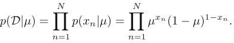
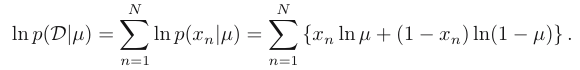
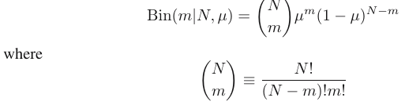
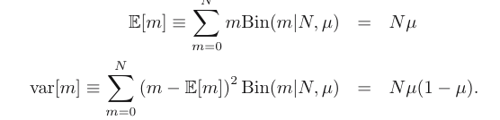

# Binary Variables

## Bernulli probability
Bernulli probability distribution: $Bern(x|μ) = μ^x (1 − μ)^{1 −x}$ for binary random variable.
The important values: $E[x] = μ$ and $var[x] = μ(1-μ)$.

Suppose we have a data set $D = {x_1 , . . . , x_N}$ of observed values of x. We have likelihood function of $\mu$:
 
We can estimate the maximum of likelihood function by log form (its similar):

=> the log likelihood function depends on the $N$ observations $x_n$ only through their sum $\sum_n x_n$
=> [sufficient statistics](https://www.statisticshowto.com/sufficient-statistic/#:~:text=A%20sufficient%20statistic%20summarizes%20all,in%20the%20original%20data%20points.) 

The maximum likelihood estimator is cal from derivative above func:
$\mu_{ML} = \frac{1}{N} \sum_{n=1}^{N} x_n$ , also as the sample mean.
But it can lead to the over-fitting associated with maximum likelihood => _binomial distribution_

## Binomial distribution
The formulation of this dis, we have to add up all of the possible ways of obtaining m:

The mean and variance:

##  The beta distribution
# Mutinomial Variables

# The Gaussian Distribution

# The Exponential Family

# Nonparametric Methods
