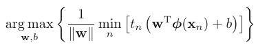
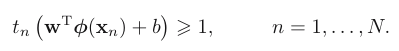
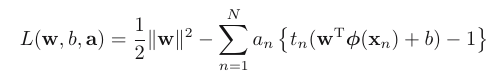
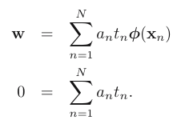
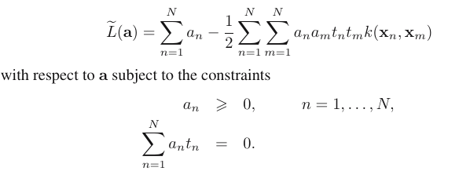
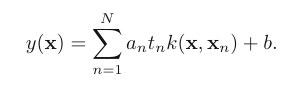

Bassicaly, in previous chapters, we see how the kernel work. It compute every couple of data points $(x_n, x_m)$ and take o lot of computation, dose it really need?
=> Introduction of Sparse kernel machine, where we use a subset but not the whole dataset for calculate based on kernel methods. Let dive in!

# Maximum Margin Classifiers
In support vector machines the *decision boundary* is chosen to be the one for *which the margin is maximized*.

- Also introduce the Bayesian approach to deal with hyperplane (separate), so how can Bayensian can be approach in this?
Using the Parzen density estimator with Gaussian kernels to evaluate data samples => find the $\sigma^2$ => find the hyperplane that make limit $\sigma^2  -> 0$.

The problem with maximize the margin is defined by argmax and constraint:
                                 (1)
                               (2)
                    
 => This is known as the _canonical representation_ of the decision hyperplane.
 For (2), for those point the equal happen, the constraints are said to be `active`. And vice versa!
 
In order to solve this constrained optimization problem, we introduce Lagrange
multipliers $a_n >= 0$ 

        
             
Where $a = (a_1 , . . . , a_N )^T$ . Note the minus sign in front of the Lagrange multiplier term, because we are minimizing with respect to w and b, and maximizing with respect to a.
After derivate the $L$, we have:

                               
  
 Plug back to L we have:
 
  
  
  New data is classify by:
  
                   
              
## Overlapping class distributions

##  Relation to logistic regression

##  Multiclass SVMs

## SVMs for regression

## Computational learning theory

# Relevance Vector Machines

## RVM for regression

## Analysis of sparsity

## RVM for classification

