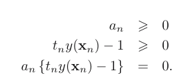

Bassicaly, in previous chapters, we see how the kernel work. It compute every couple of data points $(x_n, x_m)$ and take o lot of computation, dose it really need?
=> Introduction of Sparse kernel machine, where we use a subset but not the whole dataset for calculate based on kernel methods. Let dive in!

# Maximum Margin Classifiers
In support vector machines the *decision boundary* is chosen to be the one for *which the margin is maximized*.

- Also introduce the Bayesian approach to deal with hyperplane (separate), so how can Bayensian can be approach in this?
Using the Parzen density estimator with Gaussian kernels to evaluate data samples => find the $\sigma^2$ => find the hyperplane that make limit $\sigma^2  -> 0$.

The problem with maximize the margin is defined by argmax and constraint:              (1)
           (2)
                    
 => This is known as the _canonical representation_ of the decision hyperplane.
 For (2), for those point the equal happen, the constraints are said to be `active`. And vice versa!
 
In order to solve this constrained optimization problem, we introduce Lagrange
multipliers $a_n >= 0$ 

             
Where $a = (a_1 , . . . , a_N )^T$ . Note the minus sign in front of the Lagrange multiplier term, because we are minimizing with respect to w and b, and maximizing with respect to a.
After derivate the $L$, we have:

  
 Plug back to L we have:
 
  
New data is classify by:
   (3)
  
And a other thing is this constraint sastisfie the KKT condition:
 
For every datapoint, , either the $a_n$ or $t_{n}y(x_n) - 1 = 1$.  So that datapoints with $a_n = 0$ will not show in equation (3) and make no contribute for the predict process. And the rest points are so call the _support vectors_.
     => Once the model is trained, a significant proportion of the data points can be discarded and
only the support vectors retained.

And then b can be calculated by:

- Where N S is the total number of support vectors.

## Overlapping class distributions
Introducing the slack variables, $ξ_n >= 0$ where $n = 1, . . . , N$, with one slack variable for each training data point to punish the wrong datapoints.
- Value: 
        + $ξ_n = 0$ for data points that are on or inside the correct margin boundary
        + $ξ_n = |t_n − y(x_n)|$ for other points (data point that is on the decision boundary have $ξ_n = 0$)
        +  $ξ_n = 1$ are misclassified.
The constraint are now:   $t_ny(x_n) >= 1 − ξ_n$ 

Our goal is now to maximize the margin while softly penalizing points that lie on the wrong side of the margin boundary. And also introduce the $C$ penalty variable.

 
- Where $C$ controls the trade-off between the slack variable penalty and the margin.
=> C is a regularization coefficient because it controls the trade-off between minimizing training errors and controlling model complexity.

The Largrange:

- Where  ${a_n \geq 0}$ and $μ_n \geq 0$ 

The KKT condition:

=>

After eliminate w, b, and $ξ_n$ from the Lagrangian using above equations, we have:

And we have new constraint: 
$0 \leq a_n \leq C$  and $\sum{a_n t_n} = 0$ => this is box constraint => Quadratic problem!!!

With $a_n = 0$, the datapoints are not contribute to the predictive model. And the rest have $a_n > 0$ must satisfy:
$t_n y(x_n) = 1 - ξ_n$

$b$ can be calculated similar to normal svm (addition just care the datapoints having $0 < a_n < C$)

One of the most popular approaches to training support vector machines is called `sequential minimal optimization, or SMO`. It takes the concept of chunking to the extreme limit and considers just two Lagrange multipliers at a time.

##  Relation to logistic regression
Do somthings with Hinge Loss

##  Multiclass SVMs
Outdate approachs :))
## SVMs for regression

## Computational learning theory

# Relevance Vector Machines

## RVM for regression

## Analysis of sparsity

## RVM for classification

